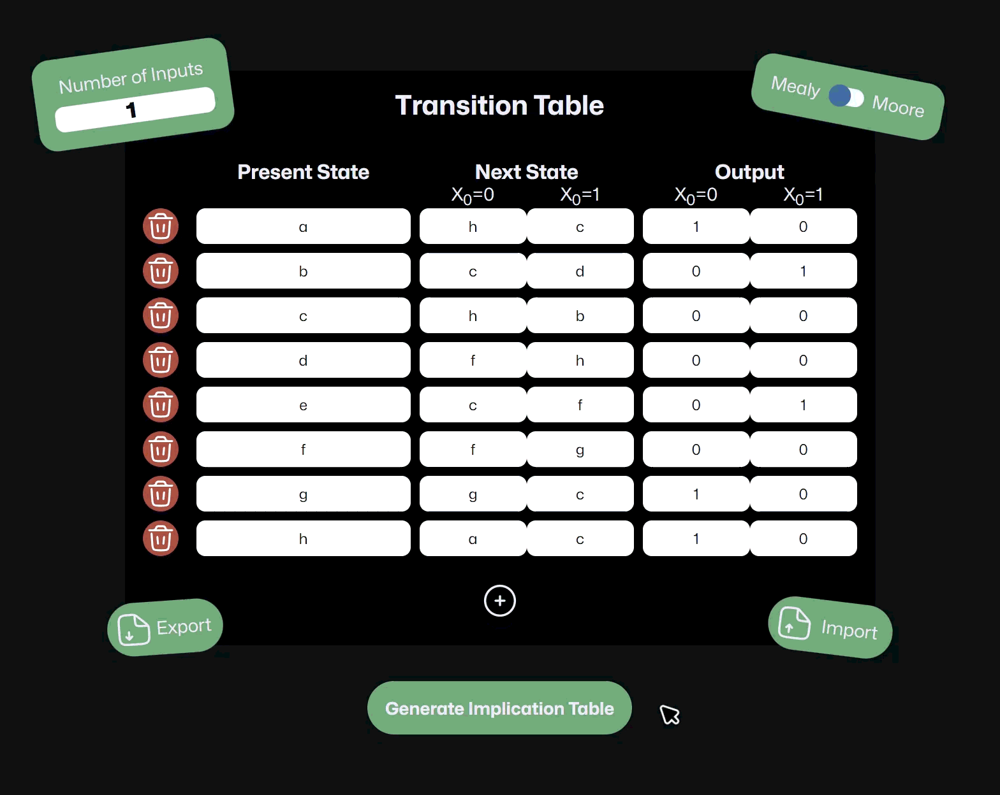

# fsm-minimizer 🔥

> Minimize complex finite state machines using implication tables

FSM Minimizer is an interactive application for minimizing finite state machines (FSM) using implication tables. It supports both **Moore** and **Mealy** machine types and provides a visual, step-by-step reduction process. Available as both a **web app** and a **native desktop app** powered by Tauri.



## ✨ Features

- 🎯 **Dual Mode Support**: Works with both Moore and Mealy state machines
- 📊 **Interactive Tables**: Visualize transition tables, implication tables, and minimized results
- 🔄 **Step-by-Step Reduction**: Watch the implication table evolve as equivalences are discovered
- 💾 **Save & Load**: Export/import your state machines as JSON files
- 🎨 **Smooth Animations**: Beautiful GSAP-powered transitions and interactions
- ⚡ **Dynamic Input Configuration**: Support for multiple inputs (X₀, X₁, X₂, ...)
- ✅ **Real-time Validation**: Instant feedback on duplicate states and incomplete data
- 🖥️ **Desktop App**: Native cross-platform app via Tauri with persistent window state

## 🛠️ Tech Stack

- **TypeScript** (~6.0.2) - Type-safe development
- **Vite** (^8.0.4) - Fast build tool and dev server
- **GSAP** (^3.14.2) - Professional-grade animations with SplitText plugin
- **Tauri** (^2.10.3) - Native desktop app framework (Rust-based)
- **CSS Grid** - Responsive table layouts
- **HTML5** - Modern semantic markup
- **Mona Sans** - Custom font for UI


## 🌐 Web App

### Prerequisites

- Node.js
- npm, yarn, or bun

### Installation

```bash
# Clone the repository
git clone https://github.com/ZiedDev/fsm-minimizer/

# Navigate to project directory
cd fsm-minimizer

# Install dependencies
bun install
# or
npm install
# or
yarn install

# Start development server
bun run dev
# or
npm run dev
# or
yarn run dev
```

### Build for Production

```bash
# Build the project
bun run build
# or
npm run build
# or
yarn run build

# Preview production build
bun run preview
# or
npm run preview
# or
yarn run preview
```

### Deploy to GitHub Pages

```bash
bun run deploy
# or
npm run deploy
# or
yarn run deploy
```

## 🖥️ Desktop App (Tauri)

FSM Minimizer can be run as a native desktop application on **Windows** using [Tauri](https://tauri.app/). 
> (If you wish to use the app on **MacOS** or **Linux** you will have to build the app yourself)

### Prerequisites

In addition to the web app prerequisites, you'll need:

- **Rust** (1.77.2 or newer) — [Install via rustup](https://rustup.rs/)
- **Tauri CLI** — installed automatically as a dev dependency via npm/bun
- Platform-specific system dependencies — see the [Tauri prerequisites guide](https://tauri.app/start/prerequisites/)

### Development

```bash
# Install dependencies (if not already done)
bun install

# Start the Tauri dev window
bun run tauri dev
# or
npm run tauri dev
# or
yarn run tauri dev
```

This launches a native window with hot-reload connected to the Vite dev server at `http://localhost:5173`.

### Build for Production

```bash
bun run tauri build
# or
npm run tauri build
# or
yarn run tauri build
```

The compiled installer/binary will be output to `src-tauri/target/release/bundle/`. Tauri builds native packages for your current platform (`.msi`/`.exe` on Windows, `.dmg`/`.app` on macOS, `.deb`/`.AppImage` on Linux).

### Desktop Features

- **Persistent window state** — window size and position are remembered across sessions via `tauri-plugin-window-state`
- **Resizable window** — minimum size of 400×300, default 800×600

### Desktop Project Structure

```
src-tauri/
├── src/
│   ├── main.rs              # Tauri entry point
│   └── lib.rs               # App setup (plugins, window state)
├── capabilities/
│   ├── default.json         # Default permission set
│   └── desktop.json         # Desktop-specific capability (macOS/Windows/Linux)
├── icons/                   # App icons for all platforms
├── Cargo.toml               # Rust dependencies
├── Cargo.lock               # Rust lock file
├── build.rs                 # Tauri build script
└── tauri.conf.json          # Tauri configuration (app name, window, bundle targets)
```

## 📖 How to Use

### 1. **Set Up Your Machine**
   - Choose machine type: **Moore** or **Mealy**
   - Set the number of inputs (default: 1)
   - Click **+** to add state rows

### 2. **Enter State Information**
   - **Present State**: Current state name (e.g., a, b, c, d)
   - **Next State**: Transition states for each input combination (X₀=0, X₀=1, etc.)
   - **Output**: Output values (single for Moore, per-transition for Mealy)

### 3. **Generate Implication Table**
   - Click **Generate** to create the implication table
   - The table shows which state pairs are equivalent or incompatible

### 4. **Step Through Reduction**
   - Click **Next** to progressively simplify the implication table
   - Compatible states are marked with <span style="color:green">**✓**</span>
   - Incompatible states are marked with <span style="color:red">**×**</span>

### 5. **View Minimized Result**
   - Once complete, see your minimized state machine
   - States are relabeled (A, B, C, ...)
   - View the reduction summary (e.g., "8 → 3 states")

## 🎓 Example

Here's a sample Mealy machine included in the code:

| Present State | X₀=0 | X₀=1 | Output (X₀=0) | Output (X₀=1) |
|---------------|------|------|---------------|---------------|
| a             | h    | c    | 1             | 0             |
| b             | c    | d    | 0             | 1             |
| c             | h    | b    | 0             | 0             |
| d             | f    | h    | 0             | 0             |
| e             | c    | f    | 0             | 1             |
| f             | f    | g    | 0             | 0             |
| g             | g    | c    | 1             | 0             |
| h             | a    | c    | 1             | 0             |

After minimization, this reduces to fewer equivalent states using the implication table method.

## 💾 Import/Export

### Export
Click the **Download** button to save your current table as a JSON file. The file will be named `My Table [DATE].json`.

### Import
Click **Choose File** to load a previously saved JSON file.

**JSON Format:**
```json
{
  "presentState": ["a", "b", "c"],
  "nextState": [["b", "c"], ["a", "b"], ["c", "a"]],
  "output": [["0", "1"], ["1", "0"], ["0", "0"]],
  "mode": "mealy",
  "inputNum": 1
}
```

## 📁 Project Structure

```
fsm-minimizer/
├── src/
│   ├── main.ts              # Core application logic
│   ├── style.css            # Styling and animations
│   └── assets/...           # Additional assets
├── src-tauri/...            # Tauri files
├── public/
│   ├── favicon.svg          # App favicon
│   └── showcase.gif         # README.md preview GIF
├── dist/...                 # Production build (generated)
├── index.html               # Main HTML file
├── vite.config.ts           # Vite + Tauri dev server config
└── package.json             # Dependencies and scripts
```

## 🎨 Features

### Validation
- Real-time input validation
- Duplicate state detection
- Empty field detection
- Non existing Present state used in Next state
- Visual feedback with tooltips on disabled buttons

### User Experience
- Responsive design
- Interactive row deletion with animation
- Auto-scrolling to relevant content
- Dynamic table headers based on input count
- Navigating with keyboard keys

### Animations
- GSAP-powered smooth transitions for all UI interactions
- SplitText animations for character-by-character text reveals
- Elastic easing for natural, playful motion
- Smooth scrolling to new content sections


## 🤝 Contributing

Contributions are welcome! Please feel free to submit a Pull Request.


## 🙏 Acknowledgments

- **Tauri** for the native cross-platform desktop app framework
- **GSAP** for smooth, professional animations
- **Vite** for blazing-fast development experience
- **Mona Sans** font by GitHub
- Solar Icons by 480 Design (CC BY 4.0)

## 📧 Contact

Discord: [ohzied](https://discord.com/users/484808856128585750)

---

**Made with ❤️ for digital logic enthusiasts**
